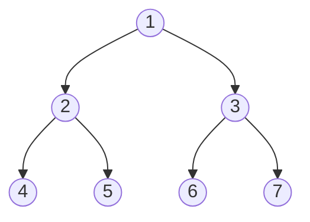

- Each node in a binary tree has at most two children.
- There are at most $2k$ nodes in level $k$.
- The [[#Binary Tree Depth]] at depth $d$ has ==at most $2^{d-1}-1$ nodes==.
	- $1+2+4+\dots+2^{d}=2^{d-1}-1$
- If a binary tree has $N$ vertices, its depth is
	- At least $\Omega\left(\log{N}\right)$
	- At most $N-1$

## Example of a Binary Tree



- Level 2 has $2^{2}$ nodes: $\text{[4, 5, 6, 7]}$.
  
## Binary Tree Depth

A binary tree of depth $d$ has at most $2^{d-1}-1$ nodes.

### Code

```java
private int height(Node<T> root) {
	// The tree doesn't exist, so the height can be -1, or throw
	// an error.
	if (root == null) return -1;
	else return Math.max(height(root.left), height(root.right)) + 1
}
```

The function recurses down the left and right subtrees, and returns the max value of the two. It adds one for the root node.

An iterative approach makes use of a stack:

```java
private int height(Node<T> root) {
	if (root == null) return -1;
	
	Stack<Node<T>> stack = new Stack<>();
	stack.push(root);

	int height = 0;

	while (!stack.isEmpty()) {
		height++;
		Stack<Node<T>> tempStack = new Stack<>();
		
		while (!stack.isEmpty()) {
            Node node = stack.pop();
            
            if (node.left != null) {
                tempStack.push(node.left);
            }
            if (node.right != null) {
                tempStack.push(node.right);
            }
        }
        
        stack = tempStack;
	}
	
	return height;
}
```

### Proof
**Base Case**

When $d=1$, the tree consists of only one node. Therefore it has **at most** $2^{1-1}-1=0$ nodes, which satisfies the hypothesis that 0 is $\le 2^{1-1}-1$. This concludes the base case.

___

**Inductive Hypothesis**

Assume for $k\in I^{+}$, any binary tree of depth $k$ has **at most** $2^{k-1}-1$ nodes.

___

**Inductive Step**
## Size

The size of a binary tree is the number of nodes in the tree.

In the [[#Example of a Binary Tree]], it has a size of 7.

### Code

```java
public int size(Node<T> root) {
	if (root == null) return 0;
	else return size(root.left) + size(root.right) + 1
}
```

The function uses ==recursion== to compute the size. It computes the size of the left trees, and the right trees, and adds one as the root of the tree.

## Traversal
The different forms of traversal depend on where the root node is included in the traversal.
### In-Order
An in-order traverses in the following manner:
1. Visit the left subtree
2. Visit the root
3. Visit the right subtree

From the [[#Example of a Binary Tree]], the in-order traversal will look like:
1. 1 -> 5 -> 7
2. 10
3. 16 -> 21 -> 25

To yield the order $\text{[1, 5, 7, 10, 16, 21, 25]}$.

#### Code
```java
public void inOrderTraversal(Node<T> root) {
	if (root == null) return;
	else {
		inOrderTraversal(root.left);
		System.out.println(root.data);
		inOrderTraversal(root.right);
	}
}
```

### Pre-Order
Pre-order traversal visits the root, then the left subtree, then the right subtree.
#### Code
```java
public void preOrderTraversal(Node<T> root) {
	if (root == null) return;
	else {
		System.out.println(root.data);
		inOrderTraversal(root.left);
		inOrderTraversal(root.right);
	}
}
```

### Post-Order
Post-order traversal visits the left subtree, then the right subtree, then the root.
#### Code
```java
public void postOrderTraversal(Node<T> root) {
	if (root == null) return;
	else {
		inOrderTraversal(root.left);
		inOrderTraversal(root.right);
		System.out.println(root.data);
	}
}
```

## Pseudocode
### Binary Tree Node
```java
public class Node<T> {
	private T value;
	private Node<T> left;
	private Node<T> right;
	private Node<T> parent;
}
```
### Binary Tree
```java
public class BinaryTree<T> {
	private Node<T> root;
}
```
